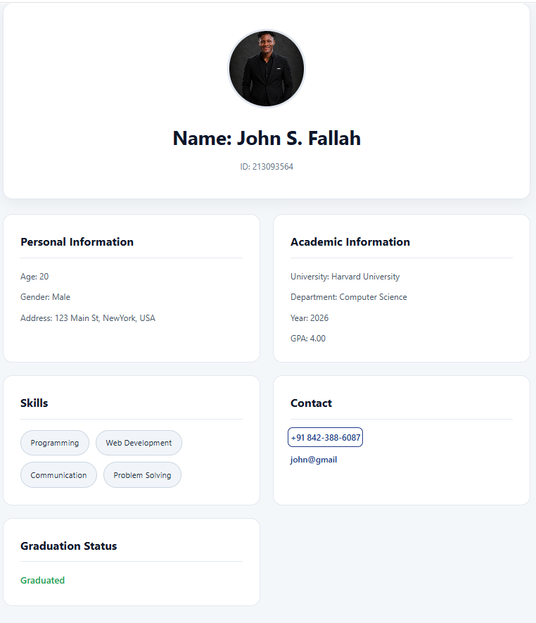

# 🎓 StudentCard

A clean and responsive React application that demonstrates the use of **props**, **component composition**, and reusable UI design by rendering a professional student profile card.

---

## 📸 Preview



---

## ✨ Features

- 👤 Student profile card
- 🖼️ Profile image support
- 🎓 Academic information
- 📍 Personal information
- 💻 Skills list rendered dynamically
- 📞 Contact section
- ✅ Graduation status indicator
- 📱 Responsive layout
- 🎨 Modern and professional UI

---

## 🛠️ Built With

- ⚛️ React
- ⚡ Vite
- 🎨 CSS3
- 🧩 JSX
- 📦 JavaScript (ES6+)

---

## 📂 Project Structure

```text
student-card/
│
├── public/
│
├── src/
│   ├── assets/
│   │     └── image.png
│   │
│   ├── components/
│   │     └── StudentCard.jsx
│   │
│   ├── App.jsx
│   ├── App.css
│   ├── main.jsx
│   └── index.css
│
├── package.json
├── vite.config.js
└── README.md
```

---

## 🚀 Getting Started

### Clone the repository

```bash
git clone https://github.com/yourusername/student-card.git
```

### Navigate into the project

```bash
cd student-card
```

### Install dependencies

```bash
npm install
```

### Run the development server

```bash
npm run dev
```

The application will be available at:

```text
http://localhost:5173
```

---

## 📖 Learning Objectives

This project was built to practice fundamental React concepts, including:

- Functional Components
- Props
- JSX
- Dynamic Rendering
- Component Reusability
- Responsive UI Design
- CSS Layout using Grid & Flexbox

---

## 🧠 React Concepts Used

- Props
- Component-based Architecture
- Conditional Rendering
- Array Rendering using `.map()`
- JSX Expressions

---

## 🎨 Design Principles

The UI follows a timeless and professional design philosophy.

- Minimalist Layout
- Responsive Design
- Corporate Color Palette
- Soft Shadows
- Consistent Typography
- Accessible Contrast
- Micro Interactions

---

## 📷 Screenshots

### Desktop

_Add screenshot here_

---

### Tablet

_Add screenshot here_

---

### Mobile

_Add screenshot here_

---

## 🔮 Future Improvements

- Dark Mode
- Theme Switcher
- Editable Student Information
- API Integration
- Search Students
- Multiple Student Cards
- React Router
- TypeScript Support
- Unit Testing
- Local Storage Support

---

## 👨‍💻 Author

**John S. Fallah**

- GitHub: https://github.com/fallah-123
- LinkedIn: https://linkedin.com/in/https://www.linkedin.com/in/john-fallah-b06910374/

---

## 📄 License

This project is licensed under the MIT License.

Feel free to use this project for learning and educational purposes.

---

## ⭐ Support

If you found this project helpful, consider giving it a ⭐ on GitHub.

It helps support the project and encourages future improvements.
